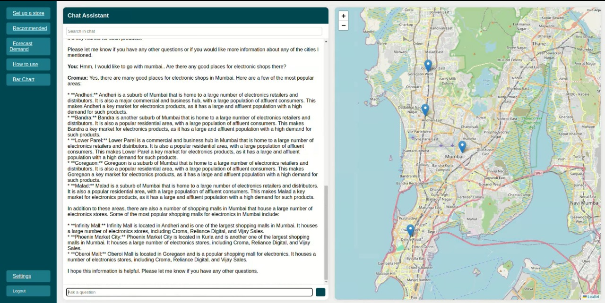
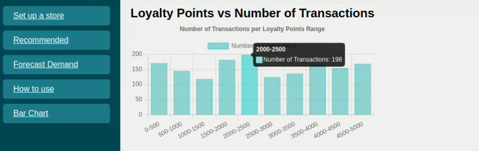
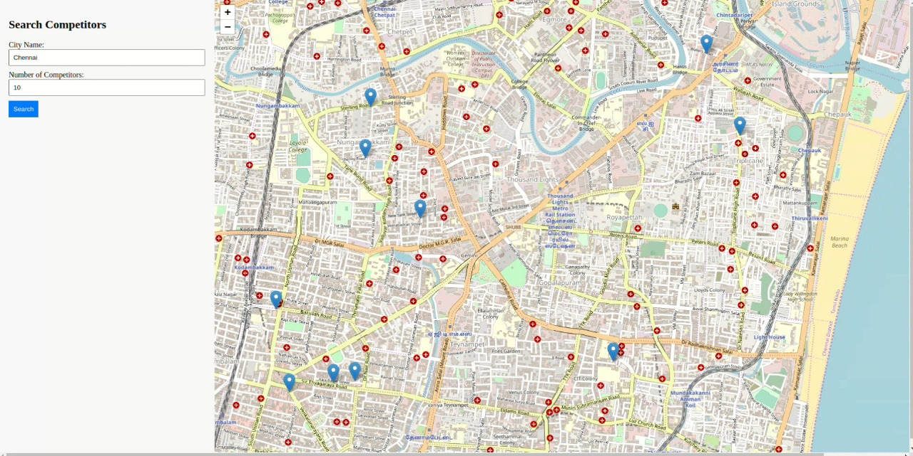
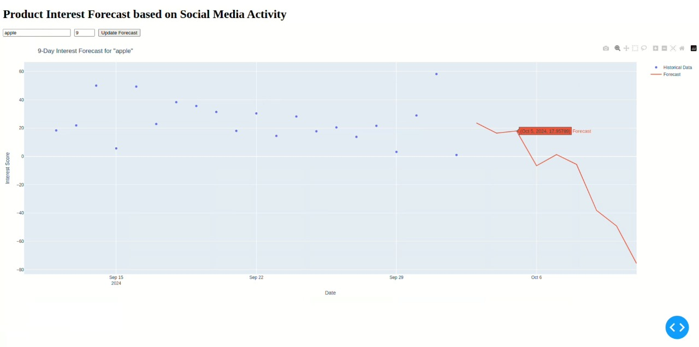

# Cromax

This is Cromax, a website designed to help 3 key stakeholders

1. `New shop owners`: looking to start a business in selling electronic items
2. `Existing shop owners`: who would like to understand consumer behaviour and get analytics
3. `The general consumer`: to find best deals for croma appliances 

Cromax is a `genAI` based application, it uses natural language to understand what the user is talking about and interacts with `maps`, `graphs` and more.

## Features

Here are some key features of Cromax
---
1. Chatbot that controls web elements
2. Demand Forecasting
3. Competitor Analysis
4. Product recommendation LLM
---

  
  
  
  

---

## Steps to run the development server

This website has not been hosted yet, to run it locally follow these steps.

Install the required dependencies from each folder using (the necessary instructions have been given in each directory)

		pip install -r requirements.txt

- Ensure that you have `node` and `npm` install.

### Running the node server

Head to [Dashbord](./node_testing/Dashbord) to get the steps for running the noder server.

### Running the python server

Head to [python source](./node_testing/Dashboard/Backend/_src) to find steps to run the flask backend
